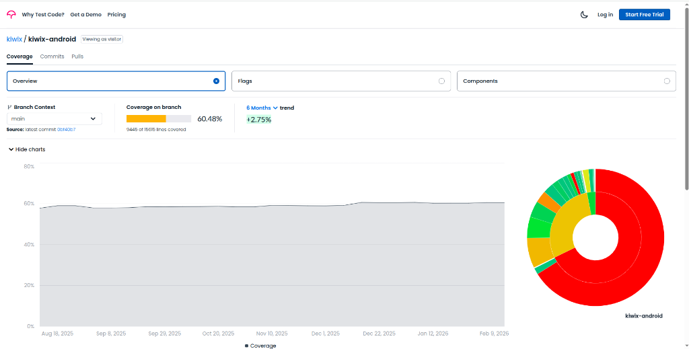
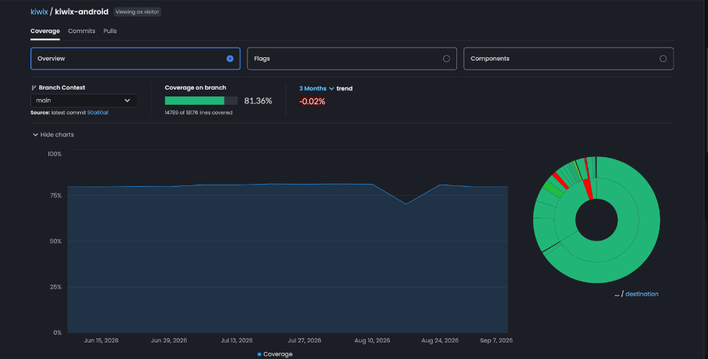

# Google Summer of Code 2026 – Final Evaluation Report

## Kiwix Community

### Project: Testing & Reliability Engineering for Kiwix Android

**Contributor:** Atharv Yadav

**Mentor:** Mohit Mali

**Program:** Google Summer of Code 2026

**Repository:** [kiwix/kiwix-android](https://github.com/kiwix/kiwix-android)

---

# Final Evaluation Summary

My GSoC 2026 project was **Testing & Reliability Engineering** for [kiwix-android](https://github.com/kiwix/kiwix-android) under the Kiwix Community. Kiwix is an open-source Android app that lets people read Wikipedia, TED Talks, and other educational content completely offline.

My work revolved around bringing the test coverage up, fixing how tests were structured, and making sure the CI pipeline was stable. Along the way I also did some refactoring to make things easier to test, migrated a screen to Jetpack Compose, and fixed some real production bugs in the notification system. By the end of GSoC, the project saw a **~20.88% increase in overall test coverage** (growing from **60.48%** to **81.36%**), which is one of the things I'm most proud of.

---

## Code Coverage Impact

During the GSoC 2026 coding period, overall branch test coverage on `kiwix-android` grew significantly:

| Metric | Before GSoC | After GSoC | Net Growth |
|---|---|---|---|
| **Coverage** | **60.48%** | **81.36%** | **+20.88%** |
| **Lines Covered** | 9,445 / 15,615 lines | 14,789 / 18,176 lines | **+5,344 lines** |

### Before GSoC (60.48% Coverage)

### After GSoC (81.36% Coverage)

---

## Table of Contents

- [Project Goals](#project-goals)
- [Code Coverage Impact](#code-coverage-impact)
- [Contribution Highlights](#contribution-highlights)
- [1. Test Infrastructure & CI Stability](#1-test-infrastructure--ci-stability)
- [2. Unit Tests](#2-unit-tests)
- [3. Room Database Tests](#3-room-database-tests)
- [4. Compose UI Tests](#4-compose-ui-tests)
- [5. Refactoring & Code Quality](#5-refactoring--code-quality)
- [6. Jetpack Compose Migration](#6-jetpack-compose-migration)
- [7. Production Bug Fixes](#7-production-bug-fixes)
- [Current State of the Project](#current-state-of-the-project)
- [Technical Skills Applied](#technical-skills-applied)
- [Learning During GSoC](#learning-during-gsoc)
- [Challenges](#challenges)
- [Final Outcome](#final-outcome)

---

## Project Goals

The codebase had a lot of untested code, tests that relied on hardcoded dispatchers, and a flaky CI that made it hard to trust the results. My goals for the summer were:

- Write **unit tests, Room DAO tests, Robolectric tests, and Compose UI tests** for components that had no coverage
- Replace hardcoded `Dispatchers.IO`, `Dispatchers.Main`, and test dispatchers like `UnconfinedTestDispatcher` with **proper coroutine test rules** for deterministic and stable results
- Migrate the fragile `testFlow()` helper to **Turbine**, which is the standard way to test Kotlin Flows
- Replace hardcoded dependencies and use `MainDispatcher` as a standard approach so tests give consistent, predictable results
- **Stabilize the CI pipeline** so PRs don't fail randomly
- Do targeted **refactoring** (Single Responsibility, Constructor Injection) to make code easier to test without changing behavior
- Migrate a legacy Fragment to Jetpack Compose as part of the broader modernization push
- Fix production **notification bugs** affecting Android 12+ users

---

## Contribution Highlights

| Area | Contributions |
|---|---|
| **Test Infrastructure** | Replaced hardcoded dispatchers with coroutine rules; migrated `testFlow()` to Turbine; stabilized CI |
| **Unit Tests** | `ZimReaderContainerUtils`, `FileOperationHandlerImpl`, `HotspotStateReceiver`, `ShareFilesTest`, `CopyMoveFileHandlerTest`, `LanguageViewModelTest`, `CategoryViewModelTest`, `CoreReaderViewModelTest`, `DeleteFiles` |
| **Room / Robolectric Tests** | `DownloadRoomDao`, `KiwixWifiP2pBroadcastReceiver`, `WebViewHistoryRoomDao` |
| **Compose UI Tests** | `DownloadBookItem`, `OnlineBookItem`, `BookItemUI` |
| **Refactoring** | Constructor Injection replacing Field Injection; `DeleteFiles` Single Responsibility refactor |
| **Compose Migration** | `CustomDownloadFragment` → `BrandedDownloadRoute` |
| **Bug Fixes** | Notification group summary fix (Android 12+), offline notification pipeline, race condition between Service and Manager |
| **Coverage Impact** | **~20% increase in overall test coverage** across the project |

---

# 1. Test Infrastructure & CI Stability

Before writing tests, the foundation had to be fixed. A lot of existing tests were using hardcoded dispatchers which made them unreliable — they'd pass on one run and fail on another. This section covers the infrastructure work I did to make everything stable.

## What I Did

- Replaced hardcoded `StandardTestDispatcher` and `UnconfinedTestDispatcher` usages with a reusable **I/O Rule**
- Replaced `Dispatchers.Main` with a **Main Rule** so all ViewModel tests use the same consistent pattern
- Replaced inline `Dispatchers.IO` hardcoding throughout the codebase with injectable dispatchers
- Migrated `testFlow()` helper to **Turbine** — the actual standard for testing Kotlin Flows
- Investigated and fixed CI flakiness so PRs could be reviewed without random failures blocking the queue

## Pull Requests

- [**#4782**](https://github.com/kiwix/kiwix-android/pull/4782) — Eliminate hardcoded `StandardTestDispatchers` and `UnconfinedTestDispatchers` with I/O Rule, and `Dispatchers.Main` with Main Rule
- [**#4951**](https://github.com/kiwix/kiwix-android/pull/4951) — Replace `testFlow()` → `test{}` Turbine and consume Turbine emissions properly
- [**#4958**](https://github.com/kiwix/kiwix-android/pull/4958) — Replace hardcoded `Dispatchers.IO` for `FileExtensions`
- [**#5018**](https://github.com/kiwix/kiwix-android/pull/5018) — Replace remaining occurrences of hardcoded `Dispatchers.IO` across the codebase
- [**#4975**](https://github.com/kiwix/kiwix-android/pull/4975) — Stabilize the CI

## Impact

- Tests became deterministic — no more random coroutine timing failures
- The whole team benefited from a stable CI that doesn't block PR reviews with phantom failures
- Flow-based tests are now cleaner and easier to follow thanks to Turbine

---

# 2. Unit Tests

This is where most of the coverage improvement came from. I went through untested classes one by one and wrote proper tests for them.

## What I Did

- Used MockK and Mockito to isolate dependencies and test individual components
- Made sure every test file follows the coroutine rule pattern established in the infrastructure work
- Refactored test files that were outdated so they align with the new base pattern from #4900

## Pull Requests

- [**#4935**](https://github.com/kiwix/kiwix-android/pull/4935) — Added Unit Test for SideEffect – `ShareFilesTest`
- [**#4942**](https://github.com/kiwix/kiwix-android/pull/4942) — Added Unit Test Cases for `ZimReaderContainerUtils` and removed a redundant `toUri` call found during testing
- [**#4913**](https://github.com/kiwix/kiwix-android/pull/4913) — Added Unit Test for `FileOperationHandlerImpl`
- [**#4911**](https://github.com/kiwix/kiwix-android/pull/4911) — Added Unit Test Cases for `HotspotStateReceiver`
- [**#4907**](https://github.com/kiwix/kiwix-android/pull/4907) — Refactored `LanguageViewModelTest` to align with #4900
- [**#4902**](https://github.com/kiwix/kiwix-android/pull/4902) — Refactored `CategoryViewModelTest` to align with #4900
- [**#4924**](https://github.com/kiwix/kiwix-android/pull/4924) — Refactored `CopyMoveFileHandlerTest` to align with #4900
- [**#4941**](https://github.com/kiwix/kiwix-android/pull/4941) — Refactored `DeleteFiles` for Single Responsibility and added Unit Test Cases
- [**#4998**](https://github.com/kiwix/kiwix-android/pull/4998) — Refactored `CoreReaderViewModelTest` completely and resolved all pre-existing TODOs in the file

## Impact

- Major coverage improvement across file handling, hotspot, ViewModels, and side-effect components
- Caught a real bug (redundant `toUri` call) while writing the `ZimReaderContainerUtils` tests

---

# 3. Room Database Tests

The database layer had no automated tests. I added Robolectric-based Room DAO tests so we can verify database behavior without needing an emulator.

## What I Did

- Set up in-memory Room databases using Robolectric
- Wrote tests covering insert, query, update, and delete operations
- Covered the download DAO, web view history DAO, and broadcast receiver behavior

## Pull Requests

- [**#4964**](https://github.com/kiwix/kiwix-android/pull/4964) — Added Robolectric tests for `DownloadRoomDao`
- [**#4962**](https://github.com/kiwix/kiwix-android/pull/4962) — Added Robolectric tests for `KiwixWifiP2pBroadcastReceiver`
- [**#4960**](https://github.com/kiwix/kiwix-android/pull/4960) — Added Room Tests for `WebViewHistoryRoomDao`

## Impact

- The database persistence layer is now tested automatically on every CI run
- No emulator dependency — tests run fast on the JVM via Robolectric

---

# 4. Compose UI Tests

As the app moves toward Jetpack Compose, I wrote UI tests for the composable components in the download flow.

## What I Did

- Used `composeTestRule`, semantic matchers, and `testTag` to target and verify composable nodes
- Tested rendering across different states (downloading, available, error)
- Found and fixed a logic issue in `BookItemUI` while writing its test

## Pull Requests

- [**#4865**](https://github.com/kiwix/kiwix-android/pull/4865) — Added Compose UI Test for `DownloadBookItem` and `OnlineBookItem`
- [**#4934**](https://github.com/kiwix/kiwix-android/pull/4934) — Added UI Test for `BookItemUI` and improved underlying logic

## Impact

- Composable components in the download flow now have proper UI test coverage
- Discovered and fixed a UI logic bug during test-driven development

---

# 5. Refactoring & Code Quality

Some classes were hard to test because of how they were structured. I did targeted refactoring to make them testable without changing what they actually do.

## What I Did

- Replaced Field Injection with Constructor Injection across multiple classes, which made mocking much simpler
- Refactored `DeleteFiles` into a single-responsibility class so it could be tested in isolation

## Pull Requests

- [**#4992**](https://github.com/kiwix/kiwix-android/pull/4992) — Replace Field Injection with Constructor Injection and simplify the codebase
- [**#4941**](https://github.com/kiwix/kiwix-android/pull/4941) — Refactor `DeleteFiles` for Single Responsibility and add Unit Test Cases

## Impact

- Constructor Injection makes classes immediately testable without needing to hack around field injection
- The refactoring work also reduced coupling between classes

---

# 6. Jetpack Compose Migration

As part of the app's shift toward Compose, I migrated one of the legacy Fragment screens.

## What I Did

- Migrated `CustomDownloadFragment` to a Jetpack Compose screen named `BrandedDownloadRoute`
- Kept full behavioral parity with the existing Fragment
- Ensured it integrates properly with the navigation architecture

## Pull Request

- [**#4896**](https://github.com/kiwix/kiwix-android/pull/4896) — Migrate `CustomDownloadFragment` → `BrandedDownloadRoute` (Fragment to Jetpack Compose)

## Impact

- One less Fragment in the codebase
- The Compose screen is testable with Compose UI tests, unlike the old Fragment

---

# 7. Production Bug Fixes

Beyond testing, I also fixed some real bugs that were affecting users on Android 12+ devices.

## What I Fixed

- Notification group summary was not showing correctly for Android 12+
- Notifications were disappearing when a network connection error occurred
- Added fallback logic so that when a network error happens, the notification automatically moves to paused state instead of vanishing
- Notifications now fully handle offline scenarios, respecting the current download pipeline
- Fixed race conditions between the Download Service and Notification Manager
- Fixed coroutine practices in the notification flow
- Fixed button interaction issues in the notification actions
- Cleaned up related code

## Pull Request

- [**#5039**](https://github.com/kiwix/kiwix-android/pull/5039) — Fix Notification summary issue for Android 12+, Pipeline and resolve offline notification bugs

## Impact

- Fixes two reported issues: [#5037](https://github.com/kiwix/kiwix-android/issues/5037) and [#5038](https://github.com/kiwix/kiwix-android/issues/5038)
- Users on Android 12+ will see correct notification grouping
- Download notifications no longer disappear silently when going offline

---

# 8. Additional Features

## Select All Feature

- [**#5032**](https://github.com/kiwix/kiwix-android/pull/5032) — Added Select All feature for selecting all books in Library Tab, Bookmark, History, and Take Notes, along with Test Cases

---

## Current State of the Project

All 22 pull requests completed during the GSoC coding period have been integrated into the repository.

| Category | Details |
|---|---|
| **Total PRs** | 22 PRs (labeled GSoC-2026) |
| **Test Coverage Improvement** | **60.48% → 81.36%** (+20.88% overall increase) |
| **Unit Tests Written** | `ZimReaderContainerUtils`, `FileOperationHandlerImpl`, `HotspotStateReceiver`, `ShareFilesTest`, `CopyMoveFileHandlerTest`, `LanguageViewModelTest`, `CategoryViewModelTest`, `CoreReaderViewModelTest`, `DeleteFiles` |
| **Room / Robolectric Tests** | `DownloadRoomDao`, `KiwixWifiP2pBroadcastReceiver`, `WebViewHistoryRoomDao` |
| **Compose UI Tests** | `DownloadBookItem`, `OnlineBookItem`, `BookItemUI` |
| **Infrastructure** | Coroutine rules, Turbine migration, CI stabilization |
| **Compose Migration** | `CustomDownloadFragment` → `BrandedDownloadRoute` |
| **Bug Fixes** | Android 12+ notification issues, offline notification pipeline, race conditions |

---

# Technical Skills Applied

## Technologies & Tools Used

- **Kotlin** — Primary language throughout
- **JUnit 4** — Unit testing framework
- **MockK / Mockito** — Mocking libraries for isolating dependencies
- **Robolectric** — Running Android tests on JVM without an emulator
- **Room** — In-memory DAO testing
- **Jetpack Compose Testing** — `composeTestRule`, semantic matchers, `testTag`
- **Kotlin Coroutines & Flow** — Structured coroutine testing with rules and scopes
- **Turbine** — Kotlin Flow testing library
- **GitHub Actions** — CI debugging and stabilization
- **Dagger / Hilt** — Dependency Injection refactoring (Constructor Injection)
- **Jetpack Compose** — Fragment to Compose screen migration

---

## Learning During GSoC

This summer taught me a lot of things I couldn't have learned just from tutorials:

- How to write tests that are actually reliable, not just tests that pass by luck
- The difference between `UnconfinedTestDispatcher` and `StandardTestDispatcher` and when each one is appropriate
- How Turbine works internally and why it's better than manual `testFlow()` helpers for collecting Flow emissions
- How to approach Robolectric + Room setup — it's not obvious and took a few iterations to get right
- How Compose testing's semantic tree works and how to write tests that aren't brittle
- How to debug CI failures that only happen in the pipeline and not locally
- What it feels like to actually ship changes into a production open-source app that real people use

---

## Challenges

There were some genuinely hard problems during the summer:

- **Coroutine test flakiness** — Some tests were timing-sensitive and would fail non-deterministically. Figuring out which dispatcher configuration was causing it took real debugging work.
- **Robolectric + Room** — Getting in-memory Room databases working correctly in a Robolectric environment required specific test runner configuration that isn't well documented.
- **Compose test semantics** — Compose testing is different from View-based testing. Understanding how the semantic tree works and why some nodes aren't found took time.
- **CI environment differences** — Some failures only happened in CI. Debugging those meant reading through long logs and understanding how the GitHub Actions environment differs from a local machine.
- **Balancing refactoring and testing** — Some classes couldn't be tested without being refactored first. Deciding how much to refactor before writing tests was a constant judgment call.

---

## Final Outcome

Over the course of GSoC 2026, I delivered **22 pull requests** to `kiwix/kiwix-android`. The most visible result of this work was pushing project-wide test coverage from **60.48% to 81.36% (+20.88%)**, but the bigger win was making the testing suite and CI pipeline genuinely dependable for the entire team. Beyond testing infrastructure, I modernized legacy UI with Jetpack Compose and solved real production bugs affecting notification reliability on Android 12+.

Before this summer, I knew how to write unit tests in isolation, but GSoC taught me what it actually takes to build reliable, deterministic test suites in a large production codebase. Working alongside Mohit Mali and Gouri Panda helped me grow into a much more disciplined engineer thinking not just about writing code, but about test architecture, long-term maintainability, and shipping code that millions of offline learners can depend on.

---

*All PR links go directly to kiwix/kiwix-android. Coverage data sourced from Codecov on the main branch (September 2026).*
